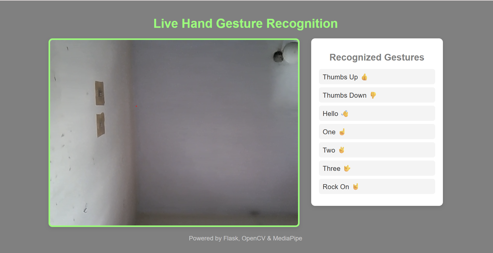
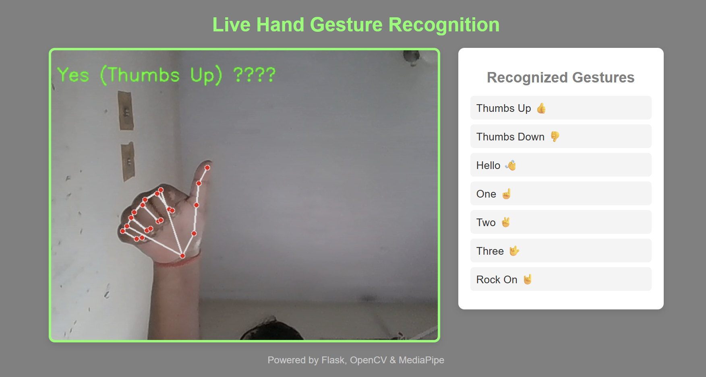
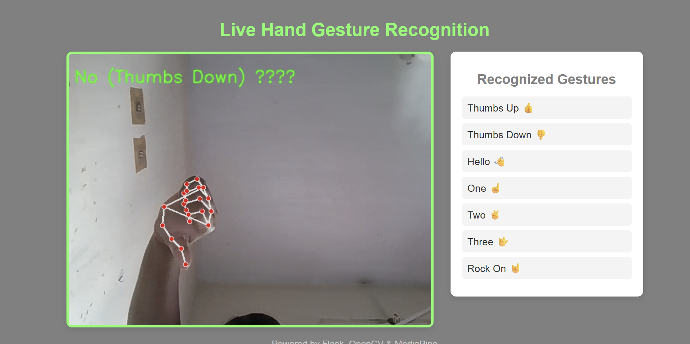

# Sign Language Detection System

A real-time Sign Language Detection System that uses computer vision and machine learning to recognize hand gestures through a webcam.

## Features

- Real-time hand gesture detection
- Hand landmark detection using MediaPipe
- Image processing using OpenCV
- Machine learning-based gesture classification
- Webcam-based detection

## Technologies Used

- Python
- OpenCV
- MediaPipe
- NumPy
- Machine Learning

## Project Structure

```text
SignLanguage-Detection/
├── app.py
├── config.py
├── extensions.py
├── ml/
├── dataset/
└── requirements.txt

## Screenshots

### Application Interface



### Sign Language Detection





## How to Run

### Step 1: Clone the Repository

`git clone https://github.com/Muskangupta17/SignLanguage-Detection.git`

`cd SignLanguage-Detection`

### Step 2: Create Virtual Environment

`python -m venv venv`

### Step 3: Activate Virtual Environment

Windows:

`venv\Scripts\activate`

### Step 4: Install Dependencies

`pip install -r requirements.txt`

### Step 5: Run the Application

`python app.py`

### Step 6: Open the Application

Open the local URL shown in the terminal and allow webcam access.

## How It Works

1. Webcam captures the hand gesture.
2. OpenCV processes the video.
3. MediaPipe detects hand landmarks.
4. The system processes the detected hand gesture.
5. The corresponding sign is identified and displayed.

## Future Improvements

- Support more sign language gestures
- Improve detection accuracy
- Add sentence-level sign language translation
- Add voice output
- Deploy the application as a web application

## Author

**Muskangupta17**

Computer Science Engineering Student
